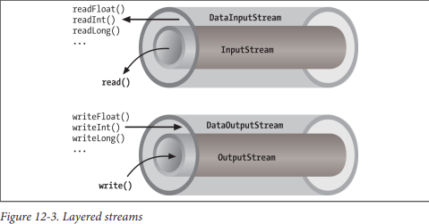
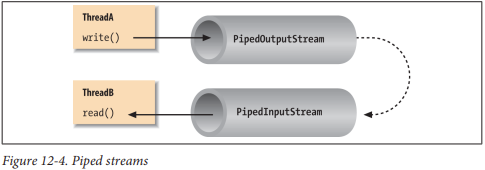

## Streams

Hầu hết các I/O cơ bản trong Java dựa trên các luồng (streams). Một luồng biểu diễn một dòng dữ liệu với (ít nhất là theo khái niệm) một bộ ghi ở một đầu và một bộ đọc ở đầu kia. Khi bạn làm việc với gói java.io để thực hiện nhập và xuất terminal, đọc hoặc ghi các tệp tin, hoặc truyền thông qua các socket trong Java, bạn đang sử dụng các loại luồng khác nhau. Sau này trong chương này, chúng ta sẽ xem xét gói NIO, mà giới thiệu một khái niệm tương tự được gọi là kênh (channel). Một điểm khác biệt giữa hai loại này là luồng được hướng theo byte hoặc ký tự trong khi các kênh được hướng theo "bộ đệm" chứa các loại dữ liệu đó nhưng chúng thực hiện công việc tương tự. Hãy bắt đầu bằng việc tóm tắt các loại luồng có sẵn:
- InputStream, OutputStream: Các lớp trừu tượng xác định chức năng cơ bản cho việc đọc hoặc ghi một chuỗi byte không cấu trúc. Tất cả các luồng byte khác trong Java được xây dựng dựa trên InputStream và OutputStream.
- Reader, Writer: Các lớp trừu tượng xác định chức năng cơ bản cho việc đọc hoặc ghi một chuỗi dữ liệu ký tự, với hỗ trợ Unicode. Tất cả các luồng ký tự khác trong Java được xây dựng dựa trên Reader và Writer.
- InputStreamReader, OutputStreamWriter: Các lớp chuyển đổi giữa các luồng byte và ký tự bằng cách chuyển đổi theo một kế hoạch mã hóa ký tự cụ thể. (Hãy nhớ: trong Unicode, một ký tự không phải là một byte!)
- DataInputStream, DataOutputStream: Các bộ lọc luồng chuyên biệt thêm khả năng đọc và ghi các loại dữ liệu nhiều byte, như các nguyên thủy số và đối tượng String trong một định dạng thông thống.
- ObjectInputStream, ObjectOutputStream: Các bộ lọc luồng chuyên biệt có khả năng ghi toàn bộ các nhóm đối tượng Java được serialized và tái tạo chúng.
- BufferedInputStream, BufferedOutputStream, BufferedReader, BufferedWriter: Các bộ lọc luồng chuyên biệt thêm bộ đệm để tăng hiệu suất. Đối với I/O thực tế, bộ đệm gần như luôn được sử dụng.
- PrintStream, PrintWriter: Các luồng chuyên biệt giúp đơn giản hóa việc in văn bản.
- PipedInputStream, PipedOutputStream, PipedReader, PipedWriter: Các luồng "Loopback" có thể được sử dụng theo cặp để di chuyển dữ liệu trong một ứng dụng. Dữ liệu được ghi vào một PipedOutputStream hoặc PipedWriter được đọc từ PipedInputStream hoặc PipedReader tương ứng của nó.
- FileInputStream, FileOutputStream, FileReader, FileWriter: Các cài đặt của InputStream, OutputStream, Reader và Writer đọc từ và ghi vào các tệp trên hệ thống tệp cục bộ.


InputStream và OutputStream là các lớp trừu tượng xác định giao diện cấp thấp nhất cho tất cả các luồng byte. Chúng chứa các phương thức để đọc hoặc ghi một dòng dữ liệu không cấu trúc ở mức byte. Bởi vì các lớp này là trừu tượng, bạn không thể tạo ra một luồng nhập hoặc xuất chung. Java thực hiện các lớp con của chúng cho các hoạt động như đọc từ và ghi vào các tệp tin và giao tiếp với các socket. Vì tất cả các luồng byte kế thừa cấu trúc của InputStream hoặc OutputStream, các loại luồng byte khác nhau có thể được sử dụng trao đổi cho nhau. Một phương thức chỉ định một InputStream là đối số có thể chấp nhận bất kỳ lớp con nào của InputStream. Các loại luồng chuyên biệt cũng có thể được xếp chồng hoặc bọc xung quanh các luồng cơ bản để thêm các tính năng như bộ đệm, bộ lọc hoặc xử lý các loại dữ liệu ở mức cao hơn.

Reader và Writer rất giống với InputStream và OutputStream, ngoại trừ việc chúng xử lý ký tự thay vì byte. Là những luồng ký tự thực sự, các lớp này xử lý đúng các ký tự Unicode, điều này không luôn đúng với các luồng byte. Thường, một cầu nối là cần thiết giữa các luồng ký tự này và các luồng byte của các thiết bị vật lý, như đĩa và mạng. InputStreamReader và OutputStreamWriter là các lớp đặc biệt sử dụng một kế hoạch mã hóa ký tự để dịch giữa các luồng ký tự và byte.

Phần này mô tả tất cả các loại luồng thú vị ngoại trừ FileInputStream, FileOutputStream, FileReader và FileWriter. Chúng ta hoãn cuộc thảo luận về luồng tệp đến phần tiếp theo, nơi chúng ta sẽ bàn về các vấn đề liên quan đến truy cập vào hệ thống tệp trong Java.

### Basic I/O

Ví dụ điển hình của một đối tượng InputStream là đầu vào tiêu chuẩn của một ứng dụng Java. Tương tự như stdin trong C hoặc cin trong C++, đây là nguồn đầu vào cho một chương trình dòng lệnh (không GUI). Đó là một luồng đầu vào từ môi trường—thường là một cửa sổ terminal hoặc có thể là đầu ra của một lệnh khác. Lớp java.lang.System, một kho chứa tổng quát cho các tài nguyên liên quan đến hệ thống, cung cấp một tham chiếu đến luồng đầu vào tiêu chuẩn trong biến tĩnh System.in. Nó cũng cung cấp một luồng đầu ra tiêu chuẩn và một luồng lỗi tiêu chuẩn trong các biến out và err tương ứng. Ví dụ dưới đây cho thấy sự tương ứng:
```java
InputStream stdin = System.in;
OutputStream stdout = System.out;
OutputStream stderr = System.err;
```
Đoạn mã này ẩn đi thực tế là System.out và System.err không chỉ là các đối tượng OutputStream, mà còn là các đối tượng PrintStream chuyên biệt và hữu ích hơn. Chúng tôi sẽ giải thích điều này sau, nhưng hiện tại, chúng ta có thể tham chiếu đến out và err như là các đối tượng OutputStream vì chúng được dẫn xuất từ OutputStream.

Chúng ta có thể đọc một byte mỗi lần từ đầu vào tiêu chuẩn bằng phương thức read() của InputStream. Nếu bạn nhìn kỹ vào API, bạn sẽ thấy rằng phương thức read() của lớp InputStream cơ bản là một phương thức trừu tượng. Đằng sau System.in là một cài đặt cụ thể của InputStream cung cấp cài đặt thực sự của phương thức read():
```java
try {
    int val = System.in.read();
} catch ( IOException e ) {
    // Xử lý ngoại lệ
}
```
Mặc dù chúng tôi nói rằng phương thức read() đọc một giá trị byte, kiểu trả về trong ví dụ là int, không phải là byte. Điều đó là vì phương thức read() của các luồng đầu vào cơ bản trong Java sử dụng một quy ước được kế thừa từ ngôn ngữ C để chỉ ra cuối của một luồng bằng một giá trị đặc biệt. Các giá trị byte dữ liệu được trả về dưới dạng số nguyên không dấu trong phạm vi từ 0 đến 255 và giá trị đặc biệt của -1 được sử dụng để chỉ ra rằng cuối của luồng đã đến. Bạn sẽ cần kiểm tra điều kiện này khi sử dụng phương thức read() đơn giản. Sau đó, bạn có thể chuyển đổi giá trị thành byte nếu cần. Ví dụ dưới đây đọc mỗi byte từ một luồng đầu vào và in giá trị của nó:
```java
try {
    int val;
    while( (val=System.in.read()) != -1 )
        System.out.println((byte)val);
} catch ( IOException e ) { 
    // Xử lý ngoại lệ
}
```
Như chúng ta đã thấy trong các ví dụ, phương thức read() cũng có thể ném một IOException nếu có lỗi khi đọc từ nguồn luồng cơ bản. Các lớp con của IOException khác nhau có thể chỉ ra rằng một nguồn như một tệp hoặc kết nối mạng đã có lỗi. Ngoài ra, các luồng cấp cao đọc các loại dữ liệu phức tạp hơn một byte có thể ném EOFException ("end of file"), cho biết một cuối luồng không mong đợi hoặc sớm.

Một phiên bản nạp chồng của phương thức read() điền một mảng byte với càng nhiều dữ liệu càng tốt lên đến dung lượng của mảng và trả về số byte đã đọc:
```java
byte[] buff = new byte[1024];
int got = System.in.read(buff);
```
Trong lý thuyết, chúng ta cũng có thể kiểm tra số byte có sẵn để đọc tại một thời điểm nhất định trên một InputStream bằng phương thức available(). Với thông tin đó, chúng ta có thể tạo ra một mảng có kích thước chính xác:
```java
int waiting = System.in.available();
if (waiting > 0) {
    byte[] data = new byte[waiting];
    System.in.read(data);
    //...
}
```
Tuy nhiên, tính đáng tin cậy của kỹ thuật này phụ thuộc vào khả năng của cài đặt luồng cơ bản để xác định được bao nhiêu dữ liệu có thể được lấy. Nó thường hoạt động cho các tệp tin nhưng không nên tin tưởng vào nó cho tất cả các loại luồng.

Các phương thức read() này chặn cho đến khi ít nhất một số dữ liệu được đọc (ít nhất một byte). Nó phải, nói chung, kiểm tra giá trị được trả về để xác định bạn đã nhận được bao nhiêu dữ liệu và liệu bạn cần đọc thêm hay không. (Chúng tôi sẽ xem xét I/O không chặn sau trong chương này.) Phương thức skip() của InputStream cung cấp một cách để nhảy qua một số byte. Tùy thuộc vào cài đặt của luồng, việc bỏ qua byte có thể hiệu quả hơn việc đọc chúng.

Phương thức close() đóng luồng và giải phóng bất kỳ tài nguyên hệ thống liên quan nào. Quan trọng là để nhớ đóng hầu hết các loại luồng khi bạn đã sử dụng xong chúng. Trong một số trường hợp, luồng có thể tự đóng khi các đối tượng được thu gom rác, nhưng không phải lúc nào cũng là một ý tưởng tốt để dựa vào hành vi này. Trong Java 7, tính năng ngôn ngữ try-with-resources được thêm vào để làm cho việc đóng luồng tự động và các thực thể closeable khác dễ dàng hơn. Chúng ta sẽ xem một số ví dụ về điều đó sau trong chương này. Giao diện cờ java.io.Closeable xác định tất cả các loại luồng, kênh và các lớp tiện ích liên quan có thể được đóng.

Cuối cùng, chúng ta nên nhắc đến rằng ngoài các luồng tiêu chuẩn System.in và System.out, Java cung cấp API java.io.Console thông qua System.console(). Bạn có thể sử dụng Console để đọc mật khẩu mà không cần hiển thị chúng trên màn hình.

### Character Streams

Trong các phiên bản sớm của Java, một số loại InputStream và OutputStream bao gồm các phương thức để đọc và ghi chuỗi, nhưng hầu hết chúng hoạt động bằng cách giả định một ký tự Unicode 16-bit tương đương với một byte 8-bit trong luồng. Điều này chỉ hoạt động cho các ký tự Latin-1 (ISO 8859-1) và không phù hợp với thế giới các mã hóa khác được sử dụng với các ngôn ngữ khác nhau. Trong Chương 10, chúng ta đã thấy rằng lớp java.lang.String có một hàm tạo mảng byte và một phương thức getBytes() tương ứng mà mỗi cái nhận mã hóa ký tự làm đối số. Trong lý thuyết, chúng ta có thể sử dụng chúng như các công cụ để chuyển đổi mảng byte thành ký tự Unicode và ngược lại để chúng ta có thể làm việc với các luồng byte biểu diễn dữ liệu ký tự trong bất kỳ định dạng mã hóa nào. Tuy nhiên, may mắn thay, chúng ta không cần phải dựa vào điều này vì Java có các luồng xử lý điều này cho chúng ta.

Các lớp ký tự java.io Reader và Writer được giới thiệu như các luồng chỉ xử lý dữ liệu ký tự. Khi bạn sử dụng các lớp này, bạn chỉ nghĩ về các ký tự và dữ liệu chuỗi và cho phép cài đặt cơ sở xử lý chuyển đổi byte thành một mã hóa ký tự cụ thể. Như chúng ta sẽ thấy, một số cài đặt trực tiếp của Reader và Writer tồn tại, ví dụ, để đọc và ghi các tệp tin. Nhưng nói chung, hai lớp đặc biệt, InputStreamReader và OutputStreamWriter, nối liền khoảng cách giữa thế giới của các luồng ký tự và thế giới của các luồng byte. Đây là một Reader và một Writer có thể bọc xung quanh bất kỳ luồng byte cơ sở nào để biến nó thành một luồng ký tự. Một kế hoạch mã hóa được sử dụng để chuyển đổi giữa các giá trị được mã hóa nhiều byte có thể và ký tự Unicode của Java. Một kế hoạch mã hóa có thể được chỉ định bằng tên trong hàm tạo của InputStreamReader hoặc OutputStreamWriter. Đối với sự tiện lợi, hàm tạo mặc định sử dụng kế hoạch mã hóa mặc định của hệ thống.

Ví dụ, hãy phân tích một chuỗi dễ đọc được từ đầu vào tiêu chuẩn thành một số nguyên. Chúng ta sẽ giả định rằng các byte từ System.in sử dụng kế hoạch mã hóa mặc định của hệ thống:
```java
try {
    InputStream in = System.in;
    InputStreamReader charsIn = new InputStreamReader(in);
    BufferedReader bufferedCharsIn = new BufferedReader(charsIn);
    String line = bufferedCharsIn.readLine();
    int i = NumberFormat.getInstance().parse(line).intValue();
} catch (IOException e) {
} catch (ParseException pe) {
}
```
Trước tiên, chúng ta bọc một InputStreamReader xung quanh System.in. Reader này chuyển đổi các byte đến từ System.in thành các ký tự bằng cách sử dụng kế hoạch mã hóa mặc định. Sau đó, chúng ta bọc một BufferedReader xung quanh InputStreamReader. BufferedReader thêm phương thức readLine(), mà chúng ta có thể sử dụng để lấy một dòng văn bản đầy đủ (lên đến một kết hợp ký tự kết thúc dòng cụ thể cho từng nền tảng) vào một chuỗi. Chuỗi sau đó được phân tích thành một số nguyên bằng cách sử dụng các kỹ thuật được mô tả trong Chương 10.

Điều quan trọng cần lưu ý là chúng ta đã lấy một luồng đầu vào dựa trên byte, System.in, và an toàn chuyển đổi nó thành một Reader để đọc ký tự. Nếu chúng ta muốn sử dụng một bộ mã hóa khác ngoài mặc định của hệ thống, chúng ta có thể đã chỉ định nó trong hàm tạo của InputStreamReader như sau:
```java
InputStreamReader reader = new InputStreamReader(System.in, "UTF-8");
```
Đối với mỗi ký tự được đọc từ reader, InputStreamReader đọc một hoặc nhiều byte và thực hiện việc chuyển đổi cần thiết thành Unicode.

Trong Chương 13, chúng tôi sử dụng một InputStreamReader và một Writer trong ví dụ về máy chủ web đơn giản của chúng tôi, nơi chúng ta phải sử dụng một bộ mã hóa ký tự được chỉ định bởi giao thức HTTP. Chúng tôi cũng quay lại chủ đề về bộ mã hóa ký tự khi thảo luận về API java.nio.charset, cho phép bạn truy vấn và sử dụng trình mã hóa và giải mã một cách rõ ràng trên các bộ đệm của ký tự và byte. Cả InputStreamReader và OutputStreamWriter đều có thể chấp nhận một đối tượng mã hóa Charset cũng như tên bộ mã hóa ký tự.

### Stream Wrappers

Nếu chúng ta muốn làm nhiều hơn là đọc và ghi một chuỗi byte hoặc ký tự, chúng ta có thể sử dụng một "luồng bộ lọc", đó là một loại InputStream, OutputStream, Reader hoặc Writer mà bao gói một luồng khác và thêm các tính năng mới. Một luồng bộ lọc nhận luồng đích làm đối số trong hàm tạo của nó và chuyển các cuộc gọi đến nó sau khi thực hiện một số xử lý bổ sung của riêng mình. Ví dụ, chúng ta có thể xây dựng một BufferedInputStream để bao gói đầu vào tiêu chuẩn của hệ thống:
```java
InputStream bufferedIn = new BufferedInputStream(System.in);
```
BufferedInputStream là một loại luồng bộ lọc đọc trước và lập bộ đệm một lượng dữ liệu nhất định. (Chúng ta sẽ nói nhiều hơn về nó sau trong chương này.) BufferedInputStream bọc thêm một lớp chức năng xung quanh luồng cơ bản. Hình 12-3 cho thấy sắp xếp này cho một DataInputStream, đó là một loại luồng có thể đọc các loại dữ liệu cấp cao hơn, như nguyên tắc Java và chuỗi.



Như bạn có thể thấy từ đoạn mã trước đó, bộ lọc BufferedInputStream là một loại InputStream. Bởi vì các luồng bộ lọc chính là các lớp con của các loại luồng cơ bản, chúng có thể được sử dụng như đối số cho việc xây dựng các luồng bộ lọc khác. Điều này cho phép các luồng bộ lọc được xếp chồng lên nhau để cung cấp các kết hợp khác nhau của tính năng. Ví dụ, chúng ta có thể đầu tiên bọc System.in của chúng ta bằng một BufferedInputStream và sau đó bọc BufferedInputStream bằng một DataInputStream để đọc các loại dữ liệu đặc biệt với bộ đệm.
Java cung cấp các lớp cơ sở để tạo ra các loại luồng bộ lọc mới: FilterInputStream, FilterOutputStream, FilterReader và FilterWriter. Các lớp cha này cung cấp cơ cấu cơ bản cho một bộ lọc "không làm gì" (một bộ lọc không làm bất cứ điều gì) bằng cách chuyển các cuộc gọi phương thức của họ đến luồng cơ bản của họ. Các luồng bộ lọc thực sự là các lớp con của chúng và ghi đè các phương thức khác nhau để thêm các xử lý bổ sung của chúng. Chúng ta sẽ tạo một ví dụ về luồng bộ lọc sau trong chương này.

#### Data streams

DataInputStream và DataOutputStream là các luồng bộ lọc cho phép bạn đọc hoặc ghi chuỗi và các loại dữ liệu nguyên thủy được tạo thành từ nhiều byte. DataInputStream và DataOutputStream thực hiện các giao diện DataInput và DataOutput, tương ứng. Các giao diện này xác định các phương thức để đọc hoặc ghi chuỗi và tất cả các loại dữ liệu nguyên thủy của Java, bao gồm số và giá trị Boolean. DataOutputStream mã hóa các giá trị này một cách độc lập với máy tính và sau đó ghi chúng vào luồng byte cơ bản của nó. DataInputStream thực hiện ngược lại.

Bạn có thể xây dựng một DataInputStream từ một InputStream và sau đó sử dụng một phương thức như readDouble() để đọc một loại dữ liệu nguyên thủy:
```java
DataInputStream dis = new DataInputStream(System.in);
double d = dis.readDouble();
```
Ví dụ này bao gói luồng đầu vào tiêu chuẩn trong một DataInputStream và sử dụng nó để đọc một giá trị double. Phương thức readDouble() đọc byte từ luồng và xây dựng một double từ chúng. Các phương thức của DataInputStream mong đợi các byte của các loại dữ liệu số được sắp xếp theo thứ tự byte mạng, một tiêu chuẩn xác định rằng các byte trật tự cao được gửi trước (còn được gọi là "big endian", như chúng ta sẽ thảo luận sau).

Lớp DataOutputStream cung cấp các phương thức ghi tương ứng với các phương thức đọc trong DataInputStream. Ví dụ, writeInt() viết một số nguyên ở định dạng nhị phân vào luồng đầu ra cơ bản.

Các phương thức readUTF() và writeUTF() của DataInputStream và DataOutputStream đọc và ghi một chuỗi Java gồm các ký tự Unicode sử dụng mã hóa ký tự "định dạng biến đổi" UTF-8. UTF-8 là một mã hóa tương thích với ASCII của các ký tự Unicode được sử dụng rộng rãi. Không phải tất cả các mã hóa đều đảm bảo bảo tồn tất cả các ký tự Unicode, nhưng UTF-8 làm được. Bạn cũng có thể sử dụng UTF-8 với luồng Reader và Writer bằng cách chỉ định nó là tên mã hóa.

#### Buffered streams

Các lớp BufferedInputStream, BufferedOutputStream, BufferedReader và BufferedWriter thêm một bộ đệm dữ liệu có kích thước được chỉ định vào đường dẫn của luồng. Một bộ đệm có thể tăng hiệu suất bằng cách giảm số lần thực hiện đọc hoặc ghi vật lý tương ứng với các cuộc gọi phương thức read() hoặc write(). Bạn tạo một luồng được đệm với một luồng đầu vào hoặc đầu ra phù hợp và một kích thước bộ đệm. (Bạn cũng có thể bọc một luồng khác xung quanh một luồng được đệm để nó hưởng lợi từ việc đệm.) Dưới đây là một ví dụ về một luồng đầu vào được đệm đơn giản được gọi là bis:
```java
BufferedInputStream bis = new BufferedInputStream(myInputStream, 32768);
...
bis.read();
```
Trong ví dụ này, chúng ta chỉ định một kích thước bộ đệm là 32 KB. Nếu chúng ta bỏ qua kích thước của bộ đệm trong hàm tạo, một bộ đệm có kích thước phù hợp sẽ được chọn cho chúng ta. (Hiện tại, giá trị mặc định là 8 KB.) Trên cuộc gọi đầu tiên đến read(), bis cố gắng lấp đầy toàn bộ bộ đệm 32 KB của chúng ta với dữ liệu, nếu có sẵn. Sau đó, các cuộc gọi đến read() truy xuất dữ liệu từ bộ đệm, và bộ đệm được điền lại khi cần thiết.

Một BufferedOutputStream hoạt động theo cách tương tự. Các cuộc gọi đến write() lưu trữ dữ liệu vào bộ đệm; dữ liệu thực sự chỉ được ghi khi bộ đệm đầy. Bạn cũng có thể sử dụng phương thức flush() để làm sạch nội dung của một BufferedOutputStream bất kỳ lúc nào. Phương thức flush() thực sự là một phương thức của lớp OutputStream. Điều quan trọng là nó cho phép bạn đảm bảo rằng tất cả dữ liệu trong bất kỳ luồng đầu vào và luồng bộ lọc nào dưới đây đã được gửi (trước khi, ví dụ, bạn đợi một phản hồi). Một số luồng đầu vào như BufferedInputStream hỗ trợ khả năng đánh dấu một vị trí trong dữ liệu và sau đó đặt lại luồng đến vị trí đó. Phương thức mark() đặt điểm trả về trong luồng. Nó nhận một giá trị số nguyên xác định số byte có thể được đọc trước khi luồng từ bỏ và quên về dấu hiệu đánh dấu. Phương thức reset() trả lại luồng đến điểm đã đánh dấu; bất kỳ dữ liệu nào được đọc sau cuộc gọi đến mark() đều được đọc lại.

Chức năng này có thể hữu ích khi bạn đang đọc luồng trong một trình phân tích cú pháp. Đôi khi bạn có thể không phân tích cú pháp cấu trúc và phải thử một điều gì đó khác. Trong tình huống này, bạn có thể yêu cầu trình phân tích của bạn tạo ra một lỗi và sau đó đặt lại luồng đến điểm trước khi nó bắt đầu phân tích cú pháp cấu trúc:
```java
BufferedInputStream input;
...
try {
    input.mark(MAX_DATA_STRUCTURE_SIZE);
    return(parseDataStructure(input));
} catch (ParseException e) {
    input.reset();
    ...
}
```
Các lớp BufferedReader và BufferedWriter hoạt động giống như các lớp dựa trên byte của chúng, ngoại trừ việc chúng hoạt động trên các ký tự thay vì byte.

#### PrintWriter and PrintStream

Một luồng bọc hữu ích khác là java.io.PrintWriter. Lớp này cung cấp một bộ các phương thức print() được nạp chồng chuyển đổi đối số của chúng thành chuỗi và đẩy chúng ra luồng. Một tập hợp bổ sung các phương thức thuận tiện println() thêm một dòng mới vào cuối các chuỗi. Đối với định dạng văn bản, các phương thức printf() và các phương thức format() tương đồng cho phép bạn viết văn bản được định dạng theo kiểu printf vào luồng.

PrintWriter là một luồng ký tự không bình thường vì nó có thể bọc cả một Output Stream hoặc một Writer khác. PrintWriter là anh em lớn hơn và mạnh mẽ hơn của luồng byte truyền thống PrintStream. Các luồng System.out và System.err là các đối tượng PrintStream; bạn đã thấy những luồng như vậy rải rác trong cuốn sách này:
```java
System.out.print("Hello, world...\n");
System.out.println("Hello, world...");
System.out.printf("The answer is %d", 17);
System.out.println(3.14);
```
Các phiên bản sớm của Java không có các lớp Reader và Writer và sử dụng Print Stream, chuyển đổi byte thành ký tự bằng cách đơn giản là đưa ra giả định về mã hóa ký tự. Bạn nên sử dụng PrintWriter cho tất cả các dự án mới.

Khi bạn tạo một đối tượng PrintWriter, bạn có thể truyền một giá trị Boolean bổ sung vào hàm tạo, chỉ định liệu nó có nên "tự động xả" hay không. Nếu giá trị này là true, PrintWriter tự động thực hiện một lệnh flush() trên OutputStream hoặc Writer cơ bản mỗi khi nó gửi một dòng mới:
```java
PrintWriter pw = new PrintWriter(myOutputStream, true /*autoFlush*/);
pw.println("Hello!"); // Luồng được tự động xả bởi dấu xuống dòng.
```
Khi kỹ thuật này được sử dụng với một luồng đầu ra được đệm, nó tương ứng với hành vi của các thiết bị gửi dữ liệu từng dòng một.

Lợi ích lớn khác mà các luồng in có so với các luồng ký tự thông thường là chúng bảo vệ bạn khỏi các ngoại lệ được ném bởi các luồng cơ bản. Khác với các phương thức trong các lớp luồng khác, các phương thức của PrintWriter và PrintStream không ném IOExceptions. Thay vào đó, chúng cung cấp một phương thức để kiểm tra lỗi một cách rõ ràng nếu cần. Điều này làm cho việc in văn bản trở nên dễ dàng hơn rất nhiều, đó là một hoạt động rất phổ biến. Bạn có thể kiểm tra lỗi bằng phương thức checkError():
```java
System.out.println(reallyLongString);
if (System.out.checkError()) { ... // Uh oh
```

### Pipes

Thông thường, các ứng dụng của chúng ta thường liên quan trực tiếp với một bên của một luồng cụ thể vào một thời điểm. Tuy nhiên, PipedInputStream và PipedOutputStream (hoặc PipedReader và PipedWriter) cho phép chúng ta tạo ra hai bên của một luồng và kết nối chúng với nhau, như được minh họa trong Hình 12-4. Điều này có thể được sử dụng để cung cấp một luồng truyền thông giữa các luồng, ví dụ, hoặc như một "lựa chọn" cho việc kiểm tra. Thường thì nó được sử dụng như một "gậy" để giao tiếp một API hướng luồng với một API không hướng luồng.

Để tạo một ống dẫn luồng byte, chúng ta sử dụng cả PipedInputStream và PipedOutputStream. Chúng ta có thể đơn giản chọn một bên và sau đó xây dựng bên kia bằng cách sử dụng bên đầu tiên như là một đối số:
```java
PipedInputStream pin = new PipedInputStream();
PipedOutputStream pout = new PipedOutputStream(pin);
```
Hoặc:
```java
PipedOutputStream pout = new PipedOutputStream();
PipedInputStream pin = new PipedInputStream(pout);
```
Trong mỗi ví dụ này, hiệu ứng là tạo ra một luồng đầu vào, pin, và một luồng đầu ra, pout, mà được kết nối với nhau. Dữ liệu được ghi vào pout sau đó có thể được đọc bởi pin. Cũng có thể tạo ra PipedInputStream và PipedOutputStream riêng rẽ và sau đó kết nối chúng với phương thức connect().

Chúng ta có thể làm điều tương tự trong thế giới dựa trên ký tự, bằng cách sử dụng PipedReader và PipedWriter thay vì PipedInputStream và PipedOutputStream.

Sau khi hai đầu của ống được kết nối, sử dụng hai luồng như bạn sẽ sử dụng các luồng đầu vào và đầu ra khác. Bạn có thể sử dụng read() để đọc dữ liệu từ PipedInputStream (hoặc PipedReader) và write() để ghi dữ liệu vào PipedOutputStream (hoặc PipedWriter). Nếu bộ đệm nội bộ của ống đầy, người viết sẽ bị chặn và đợi cho đến khi có không gian. Ngược lại, nếu ống rỗng, người đọc sẽ bị chặn và đợi cho đến khi có một số dữ liệu.

Một lợi ích của việc sử dụng các luồng ống là chúng cung cấp chức năng luồng trong mã của chúng ta mà không buộc chúng ta phải xây dựng các luồng mới, chuyên biệt. Ví dụ, chúng ta có thể sử dụng ống để tạo một cơ sở dữ liệu ghi nhật ký đơn giản hoặc "console" cho ứng dụng của chúng ta. Chúng ta có thể gửi các tin nhắn đến cơ sở dữ liệu ghi nhật ký thông qua một PrintWriter thông thường, và sau đó nó có thể thực hiện bất kỳ xử lý hoặc đệm nào cần thiết trước khi gửi các tin nhắn đến đích cuối cùng của chúng. Bởi vì chúng ta đang xử lý các tin nhắn chuỗi, chúng ta sử dụng các lớp PipedReader và PipedWriter dựa trên ký tự. Ví dụ dưới đây chỉ ra cấu trúc của cơ sở dữ liệu ghi nhật ký của chúng tôi:
```java
class LoggerDaemon extends Thread {
    PipedReader in = new PipedReader();

    LoggerDaemon() {
        start();
    }

    public void run() {
        BufferedReader bin = new BufferedReader(in);
        String s;
        try {
            while ((s = bin.readLine()) != null) {
                // Xử lý dòng dữ liệu
            }
        } catch (IOException e) {
        }
    }

    PrintWriter getWriter() throws IOException {
        return new PrintWriter(new PipedWriter(in));
    }
}

class myApplication {
    public static void main(String[] args) throws IOException {
        PrintWriter out = new LoggerDaemon().getWriter();
        out.println("Application starting...");
        // ...
        out.println("Warning: does not compute!");
        // ...
    }
}
```



LoggerDaemon đọc chuỗi từ đầu của ống, PipedReader được đặt tên là in. LoggerDaemon cũng cung cấp một phương thức, getWriter(), trả về một PipedWriter được kết nối với luồng đầu vào của nó. Để bắt đầu gửi tin nhắn, chúng ta tạo một LoggerDaemon mới và lấy luồng đầu ra. Để đọc chuỗi bằng phương thức readLine(), LoggerDaemon bọc một BufferedReader xung quanh PipedReader của nó để tiện lợi. Đồng thời, nó cũng trình bày ống đầu ra của mình dưới dạng một PrintWriter thay vì một Writer đơn giản.

Một lợi ích của việc triển khai LoggerDaemon với các ống là chúng ta có thể ghi nhật ký các thông báo một cách dễ dàng như khi chúng ta viết văn bản vào một cửa sổ terminal hoặc bất kỳ luồng nào khác. Nói cách khác, chúng ta có thể sử dụng tất cả các công cụ và kỹ thuật thông thường của chúng ta, bao gồm printf(). Một lợi ích khác là việc xử lý xảy ra trong một luồng khác, vì vậy chúng ta có thể tiếp tục công việc của mình trong khi bất kỳ xử lý nào đang diễn ra.

### Streams from Strings and Back

StringReader là một lớp luồng hữu ích khác; nó về cơ bản bọc chức năng của luồng xung quanh một chuỗi. Dưới đây là cách sử dụng một StringReader:

```java
String data = "There once was a man from Nantucket...";
StringReader sr = new StringReader(data);
char T = (char)sr.read();
char h = (char)sr.read();
char e = (char)sr.read();
```

Lưu ý rằng bạn vẫn phải bắt các IOException được ném bởi một số phương thức của StringReader.

Lớp StringReader hữu ích khi bạn muốn đọc dữ liệu từ một chuỗi như thể nó đến từ một luồng, chẳng hạn như một tệp, ống hoặc socket. Giả sử bạn tạo một bộ phân tích mà mong đợi đọc từ một luồng, nhưng bạn muốn cung cấp một phương thức thay thế cũng phân tích một chuỗi lớn. Bạn có thể dễ dàng thêm một bằng cách sử dụng StringReader.

Quay lại, lớp StringWriter cho phép chúng ta ghi vào một bộ đệm ký tự thông qua một luồng đầu ra. Bộ đệm nội bộ tăng khi cần thiết để chứa dữ liệu. Khi hoàn tất, chúng ta có thể lấy nội dung của bộ đệm dưới dạng một chuỗi. Trong ví dụ sau, chúng ta tạo một StringWriter và bọc nó trong một PrintWriter cho tiện ích:

```java
StringWriter buffer = new StringWriter();
PrintWriter out = new PrintWriter(buffer);
out.println("A moose once bit my sister.");
out.println("No, really!");
String results = buffer.toString();
```

Trước tiên, chúng ta in một số dòng vào luồng đầu ra để đưa dữ liệu vào và sau đó lấy kết quả dưới dạng một chuỗi bằng phương thức toString(). Theo cách khác, chúng ta có thể lấy kết quả dưới dạng một đối tượng StringBuffer bằng cách sử dụng phương thức getBuffer().

Lớp StringWriter hữu ích nếu bạn muốn chụp đầu ra của một cái gì đó thường gửi đầu ra đến một luồng, chẳng hạn như một tệp hoặc cửa sổ console. Một PrintWriter được bọc bên trong một StringWriter là một phương án thay thế khả thi cho việc sử dụng StringBuffer để xây dựng chuỗi lớn từng phần một.

### Implementing a Filter Stream

Trước khi chúng ta rời khỏi luồng (streams), hãy thử tạo một luồng của riêng chúng ta. Chúng ta đã đề cập trước đó rằng các lớp bọc luồng chuyên biệt được xây dựng dựa trên các lớp FilterInputStream và FilterOutputStream. Việc tạo một lớp con của FilterInputStream mà có thể bọc quanh các luồng khác để thêm chức năng mới rất dễ dàng. Ví dụ sau đây, rot13InputStream, thực hiện một thao tác rot13 (quay đi 13 ký tự) trên các byte mà nó đọc. rot13 là một thuật toán làm mờ đơn giản dịch các ký tự chữ cái để chúng không còn dễ đọc cho con người (nó chỉ bỏ qua các ký tự không phải chữ cái mà không làm thay đổi chúng). rot13 thú vị vì nó đối xứng: để "giải rot13" một số văn bản, bạn chỉ cần thực hiện rot13 lần nữa. Dưới đây là lớp rot13InputStream của chúng ta:

```java
public class rot13InputStream extends FilterInputStream {
    public rot13InputStream(InputStream i) {
        super(i);
    }
    
    public int read() throws IOException {
        return rot13(in.read());
    }

    // should override additional read() methods

    private int rot13(int c) {
        if ((c >= 'A') && (c <= 'Z'))
            c = (((c - 'A') + 13) % 26) + 'A';
        if ((c >= 'a') && (c <= 'z'))
            c = (((c - 'a') + 13) % 26) + 'a';
        return c;
    }
}
```

FilterInputStream cần được khởi tạo với một InputStream; đây là luồng cần được lọc. Chúng ta cung cấp một constructor phù hợp cho lớp rot13InputStream và gọi hàm constructor của lớp cha với một cuộc gọi tới super(). FilterInputStream chứa một biến thể được bảo vệ, in, trong đó nó lưu trữ một tham chiếu tới InputStream được chỉ định, khiến nó có sẵn cho phần còn lại của lớp của chúng ta.

Tính năng chính của một FilterInputStream là nó ủy quyền các nhiệm vụ nhập cho InputStream cơ bản. Ví dụ, một cuộc gọi tới phương thức read() của FilterInputStream đơn giản là quay lại và gọi phương thức read() của InputStream cơ bản để lấy một byte. Việc lọc xảy ra khi chúng ta thực hiện công việc bổ sung trên dữ liệu khi nó đi qua. Trong ví dụ của chúng ta, phương thức read() lấy một byte từ InputStream cơ bản, in, và sau đó thực hiện thao tác rot13 trên byte trước khi trả về nó. Phương thức rot13() dịch các ký tự chữ cái trong khi đơn giản chỉ bỏ qua tất cả các giá trị khác, bao gồm giá trị cuối cùng của luồng (-1). Lớp con của chúng tôi hiện giờ là một bộ lọc rot13.

read() là phương thức InputStream duy nhất mà FilterInputStream ghi đè. Tất cả các chức năng bình thường khác của một InputStream, như skip() và available(), không bị thay đổi, vì vậy các cuộc gọi tới các phương thức này được trả lời bởi InputStream cơ bản.

Nói một cách chính xác, rot13InputStream chỉ hoạt động trên một luồng byte ASCII vì thuật toán cơ bản dựa trên bảng chữ cái La Mã. Một thuật toán hoán chuyển ký tự tổng quát hơn sẽ phải dựa trên FilterReader để xử lý các lớp Unicode 16 bit đúng cách. (Ai muốn thử rot32768 không?) Chúng ta cũng nên lưu ý rằng chúng ta chưa triển khai hoàn toàn bộ lọc của mình: chúng ta cũng nên ghi đè phiên bản của read() nhận một mảng byte và các chỉ số phạm vi, có thể ủy quyền nó tới phương thức read của chính chúng ta. Trừ khi chúng ta làm như vậy, một đọc giả sử dụng phương thức đó sẽ nhận được luồng thô.